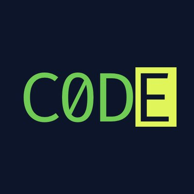
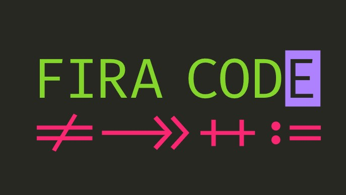

<a href="https://marketplace.visualstudio.com/items?itemName=SeyyedKhandon.firacode">
  
</a>

# FiraCode Font Pack

Free monospaced font with programming ligatures vscode extension



## 1-Click Setup:

1. Press `ctrl+shift+p`
2. Type `firacode` or `Install FiraCode Font pack `
3. Click on `Install FiraCode Font pack` to automatically add configs to your `VSCode` and install `FiraCode`

<details>
<summary>
<i>Click to see what configs this plugin will use</i>
</summary>

```json
{
  "editor.fontFamily": "Fira Code",
  "editor.fontLigatures": true
}
```

</details>

## How does it look with FiraCode font?

 

 <br/>
 
 

## Recommended Extension pack

<a href="https://marketplace.visualstudio.com/items?itemName=SeyyedKhandon.zpack">
  
</a>

[ZPack](https://marketplace.visualstudio.com/items?itemName=SeyyedKhandon.zpack) is An Opinionated collection of the `best` and `most` used extensions for Web Developers in VSCode which has Better `Developer Experience(DX)` and `load time` in Mind.

## Relevant Links

- [Github](https://github.com/SeyyedKhandon/tpack)
- [VS Code Marketplace](https://marketplace.visualstudio.com/items?itemName=SeyyedKhandon.tpack)

**Enjoy!**
